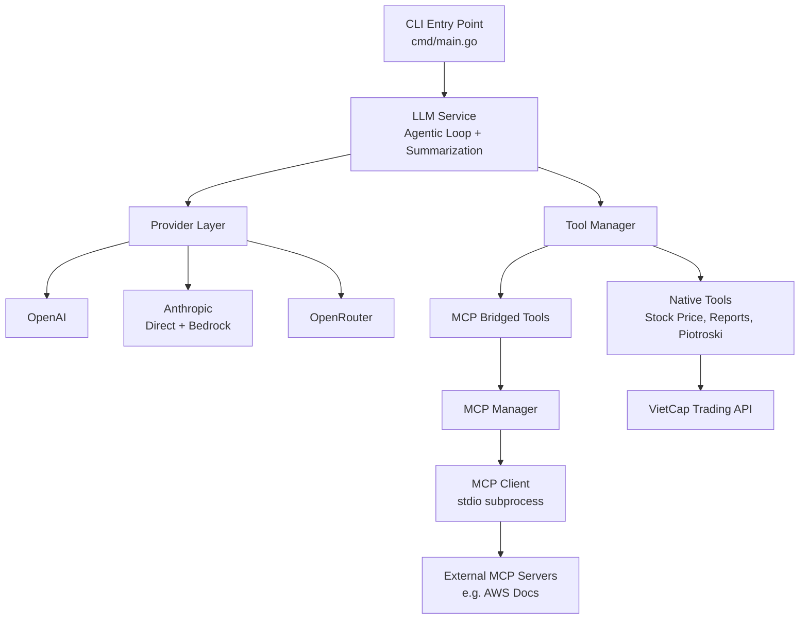
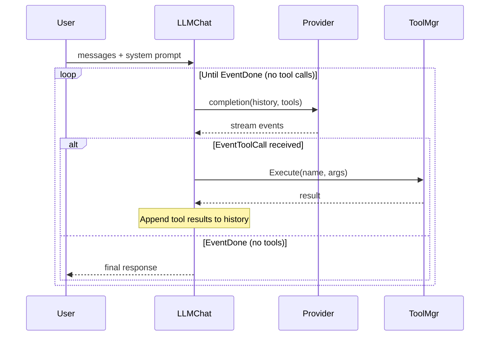
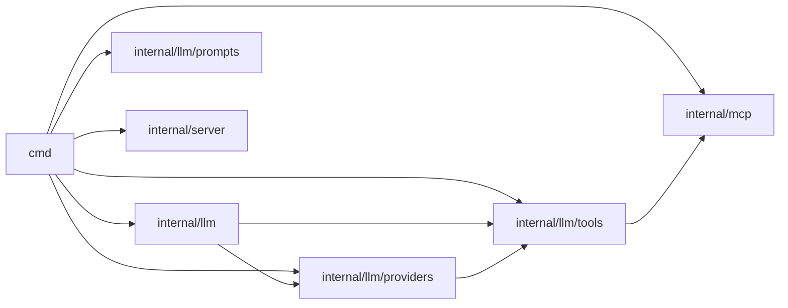

# Architecture

## High-Level Overview

LLM Core follows a layered architecture with clear separation between CLI orchestration, LLM service logic, provider implementations, and external integrations.



## Design Patterns

### Provider Pattern

The system abstracts LLM providers behind two function signatures:

```go
type completionFunc func(ctx, messages, tools, systemPrompt) (<-chan StreamEvent, error)
type structuredCompletionFunc func(ctx, prompt, result) error
```

At initialization, `NewLLMService` selects the appropriate provider based on `LLM_PROVIDER` env var and binds concrete implementations to these function types. This allows the agentic loop to be provider-agnostic.

### Agentic Tool Loop

The core execution model is an iterative loop:



Key behaviors:
- Tool calls are collected per round, then executed sequentially
- Results are appended to conversation history as assistant metadata
- The loop continues until the LLM emits `EventDone` without pending tool calls
- All events (text deltas, tool calls, tool results, errors) are streamed via a channel

### Streaming Event Model

All provider interactions produce a `<-chan StreamEvent` with typed events:

| Event Type | Purpose |
|-----------|---------|
| `EventText` | Token delta for streaming display |
| `EventThinking` | Reasoning/thinking tokens (OpenRouter) |
| `EventToolCall` | LLM requests a tool execution |
| `EventToolResult` | Tool execution result |
| `EventError` | Error during processing |
| `EventDone` | Stream complete |

### MCP Bridge Pattern

External MCP servers are integrated via a bridge that converts MCP tools into the internal `*tools.Tool` format:

1. `mcp.Manager` lazily starts MCP server subprocesses via stdio
2. `tools.BridgeMCPTools` queries each server's tool list
3. Each MCP tool gets a closure that routes `Execute` calls through `Manager.CallTool`
4. `Manager.CallTool` includes automatic retry with session eviction on failure

This allows the LLM to use external tools (e.g., AWS documentation search) identically to native tools.

### Structured Completion

For non-streaming use cases (summarization), each provider implements a `StructuredCompletion` function that:
- Sends a single prompt
- Expects JSON output (via `response_format: json_object` or Anthropic structured outputs beta)
- Unmarshals directly into a Go struct

## Data Flow

### Chat Command Flow

```
1. Load .env → providers.LoadConfig()
2. Discover MCP servers → mcp.NewManager(configs)
3. Bridge MCP tools → tools.BridgeMCPTools(ctx, manager)
4. Register native tools → tools.RegisterTools()
5. Combine all tools → tools.NewManager(native + bridged)
6. Create LLM service → core.NewLLMService(ctx, cfg, toolMgr)
7. Render system prompt → prompts.NewPromptLoader().GetSystemPrompt(...)
8. Run agentic loop → svc.LLMChat(ctx, messages, opts)
9. Stream events to console → range over channel
```

### Summarization Flow

```
1. Format messages into text block
2. Render summarization prompt template with existing summary + key facts
3. Call structuredCompletion → get JSON {summary, key_facts}
4. Return SummarizeResult with merged state
```

## Key Architectural Decisions

| Decision | Rationale |
|----------|-----------|
| Function types over interfaces | Simpler binding; providers don't share state beyond initialization |
| Channel-based streaming | Natural Go concurrency; consumers can range over events |
| Embedded templates (`//go:embed`) | Single binary deployment; no external template files |
| MCP via stdio subprocess | Standard MCP transport; no HTTP overhead for local tools |
| Lazy MCP client startup | Avoid blocking startup if MCP servers are slow |
| Retry with eviction (MCP) | MCP subprocesses can die; transparent reconnection |
| Shared HTTP client | Amortize TLS handshakes across requests |
| Tool schema from struct tags | Reduce boilerplate; `SchemaProvider` interface for complex schemas |
| No database in LLMService | Service is pure logic; persistence handled by caller (server layer) |

## Package Dependencies



## External Dependencies

| Package | Purpose |
|---------|---------|
| `urfave/cli/v3` | CLI framework |
| `openai/openai-go/v3` | OpenAI SDK |
| `anthropics/anthropic-sdk-go` | Anthropic SDK (+ Bedrock) |
| `OpenRouterTeam/go-sdk` | OpenRouter SDK |
| `modelcontextprotocol/go-sdk` | MCP protocol client |
| `aws-sdk-go-v2` | AWS credentials (STS assume role) |
| `jackc/pgx/v5` | PostgreSQL driver |
| `go-chi/chi/v5` | HTTP router (server mode) |
| `pressly/goose/v3` | Database migrations |
| `joho/godotenv` | .env file loading |
| `google/uuid` | Session IDs |

## Future Architecture (Planned)

- **`internal/server`** — HTTP API server with chi router, SSE streaming, PostgreSQL persistence
- **Stream Manager** — Manages concurrent SSE connections for real-time chat
- **Database layer** — Conversation persistence, session management via pgx + goose migrations
